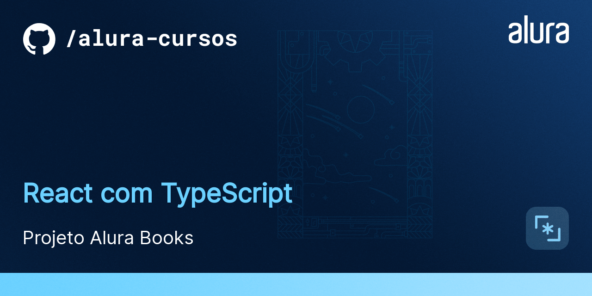

# AluraBooks

O AluraBooks é uma loja virtual que vende livros da Casa do Código. 
É um MVP que tá só começando e ainda tem muitas funcionalidades novas para serem desenvolvidas.

## 🛠️ Abrir e rodar o projeto

Para abrir e rodar o projeto, execute `npm i` para instalar as dependências e `npm start` para inicar o projeto.

Depois, acesse <a href="http://localhost:3000/">http://localhost:3000/</a> no seu navegador.